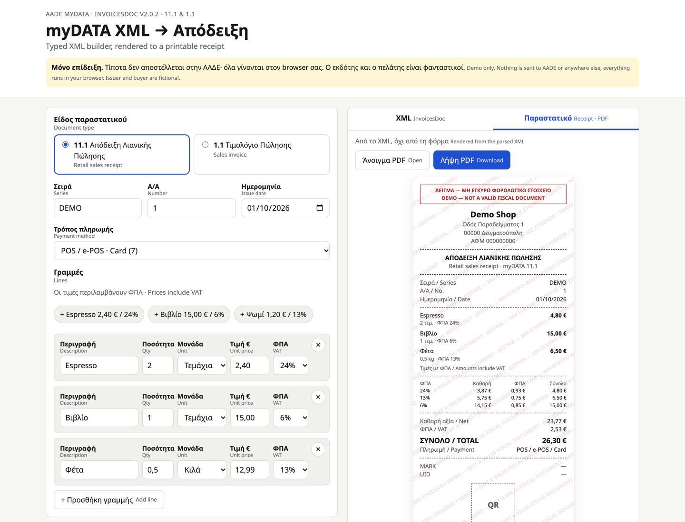

### Nikolaos Pogas

Full-stack engineer: Next.js, TypeScript, PostgreSQL. Based in Greece (EET), open to remote roles with full CET overlap.

#### What I build

- **[Ploutos](https://ploutos.hypnotech.gr)**: multi-tenant e-commerce SaaS on Next.js and Supabase. Every tenant isolated with PostgreSQL row-level security on one shared database. Payments issue the fiscal document and send it to AADE myDATA through one of 5 swappable backends. Source is private.
- **Arke**: field-service app (Expo / React Native) for installation crews. OS geofencing sets a technician's status with no taps, an offline queue syncs when signal returns, and an immutable event log backs billing disputes. Source is private.
- **[myDATA receipt demo](https://github.com/pogasnik/mydata-receipt-demo)**: typed TypeScript library that builds and XSD-validates AADE myDATA XML, plus a static page that renders an 80 mm receipt PDF from that XML. [Live](https://mydata-receipt-demo.vercel.app).

<table>
  <tr>
    <td width="33%" valign="top">
      <a href="https://ploutos.hypnotech.gr"><b>Ploutos</b></a> 
      <!--  -->
    </td>
    <td width="33%" valign="top">
      <b>Arke</b> 
      <!--  -->
    </td>
    <td width="33%" valign="top">
      <a href="https://mydata-receipt-demo.vercel.app"><b>myDATA receipt demo</b></a> 
      
    </td>
  </tr>
</table>

#### Stack

TypeScript · Next.js · React · Tailwind · PostgreSQL / Supabase · React Native / Expo · Vercel · Cloudflare R2 · GitHub Actions · Sentry · Stripe · Viva Wallet · AADE myDATA

#### Contact

[nikolaos-pogas.vercel.app](https://nikolaos-pogas.vercel.app) · [LinkedIn](https://www.linkedin.com/in/nikolaos-pogas) · [hypnotech.gr](https://hypnotech.gr) · pogasnik@gmail.com
